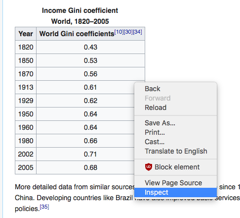
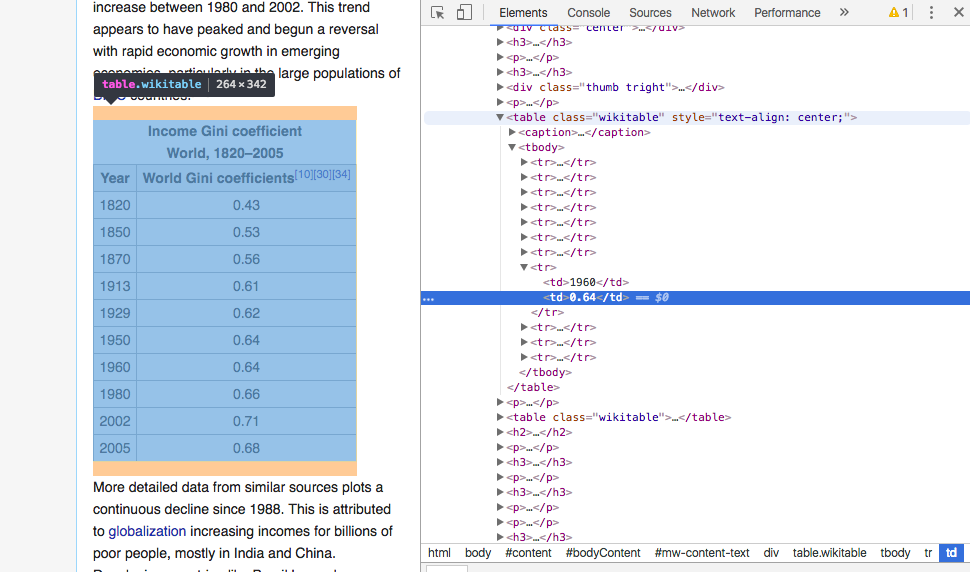
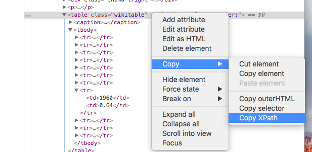
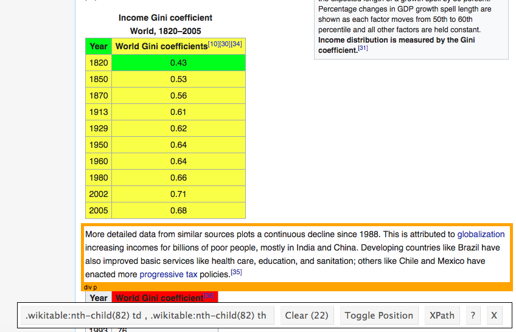
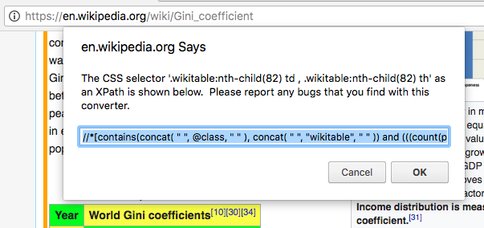

```{r opts, include = FALSE}
knitr::opts_chunk$set(message = FALSE, warning = FALSE)
```

## Outline

- *What are our goals?*
    - Basic introduction to web scraping
    - Just enough of the R language to grasp the basics
    - Be able to follow along with a program designed to get data from the internet

- *What is web scraping?*
    - Discuss good practice, robots.txt
    - HTML elements, XPaths, looking at a website's 'source'

- *Web scraping in R*
    - Give a quick overview of the R environment, data types
    - Discuss the primary functions used with the `rvest` package
    
- *Applied example: gathering job postings from labor.gov*

## What is web scraping?

- Going beyond copy/paste

- Using software to systematically gather data from websites
    - Copying information posted online for later review/analysis
    - Can be done manually
    - Or through an automated process ("crawlers", "bots", "spiders")

- Lots of terms & names for describing the same thing:
    - "web scraping" or "scraping"
    - "web harvesting"

## Good practice & responsible scraping

- Read each website's ToS and policies
    - May not be permissible for you to scrape certain data
        - copyright laws
        - trespassing
        - violation of the computer fraud and abuse act (CFAA)
    - Can get your IP Address banned
        - make you sad
        - make your institution mad
    - Public data generally okay to gather, but be conscious
    - Reaching out to web administrators is often a good idea
- Read each website's robots.txt
    - Example: https://en.wikipedia.org/robots.txt
    - How to understand a robots.txt file: https://en.wikipedia.org/wiki/Robots_exclusion_standard
    - Not all websites have a robots.txt file, but it's good to check
        - typically found right at the top of the website's directory: https://www.websitename.com/robots.txt/

## Using R: packages & workspace (0/4)

Note: I really hope you've installed the most recent version of [R](https://cloud.r-project.org/) & [RStudio](https://www.rstudio.com/products/rstudio/#Desktop) on your computer.

- 'packages' are bundles of code that other people have written for convenient use later
- they contain functions and data that are meant to be used across different projects
- start by running the following command in your console:
    - `install.packages("tidyverse")`

```{r init}
# install packages once, load packages every session
# installing *is not the same* as loading 
# load packages by calling the `library()` function on a package name
library(tidyverse)
```

## Using R: data types (1/4)

Quick look at how data is stored and represented in R (you can use the `class()` function on an object to find out what it is)

- *vectors*
    - can be thought of single columns of a spreadsheet
    - most basic type of data
    - one dimensional: length (how many items in the vector)
    - only one type of data contained in them
        - numeric (numbers, either integer values or decimals)
        - character (text based data)
        - logical (`TRUE` or `FALSE`)
        - missing values (represented by `NA` in R)
        - factor (won't cover in detail, just be aware they exist)
    - if you try to mix different types, R will try to convert ("coerce") them into a compatible type

- *lists*
    - a little more advanced
    - used to store sets of vectors or other forms of data (even lists of lists!)
    - you can store as many items in a list as you want
    - each item in the list can be a different type of data
    - and have different dimensions (rows, lengths, etc.)

- *data frames*
    - technically data frames are lists, but they probably feel more familiar
    - rows and columns (2 dimensions)
    - we <3 data frames

## Using R: data types (2/4)

```{r use-r-2}
# vectors
letters[1:12]

# lists
list(my_letters = letters[1:5], my_numbers = 1:10)

# data frames
# the mpg data set contains info about car performance, and was loaded automatically when we called library(tidyverse)
head(mpg)
```

## Using R: operators (3/4)

Operators. One note: `#` marks lines as comments

```{r ops-1}
# creating sequences using the colon
1:5

5:1

# doing math
3 * 2

1 + 1

3 - 2

4 / 8

4 ^ 2

1:10 - 1 # you can perform operations over vectors too!
```

```{r ops-2} 
# logical tests
2 == 2

2 != 4

TRUE & FALSE

TRUE | FALSE

# storing data as variables for later use
# <- is the *assignment operator*
x <- 3
y <- 22

(x * y) + 4

# getting data out of an object
mpg_cty <- mpg$cty
```

## Using R: functions (4/4)

- Just like we learned in school, functions have *names*, and take *arguments*
- Arguments go inside parentheses

```{r functions, warning = TRUE}
mean(mpg_cty) # find an average of a vector of data
mean(letters) # can't find the average of the alphabet...

table(mpg$class) # the $ operator can be used to access columns in data frames
```

```{r eval = TRUE}
# ? can be used to pull up help pages about functions, or built-in data
?mean
```

## The `rvest` package

We're going to look at the wikipedia entry for the [gini coefficient](https://en.wikipedia.org/wiki/Gini_coefficient#World_income_Gini_index_since_1800s) as an example. We'll start by discussing how to identify the areas of a page we're interested in, and how to turn that into instructions to R. Then I'll show you the functions called to retrieve the information. Let's pretend I'm interested in getting data from the table titled "Income Gini coefficient World, 1820–2005".

### Interlude: finding XPaths

In order to pluck out the information we want, we need a way to give those instructions to R/`rvest`. HTML (and XML) documents are organized as sets of nodes, and [XPaths](https://en.wikipedia.org/wiki/XPath), or CSS selectors, serve as identifiers for each of them. `rvest` functions can accept either XPaths or CSS selectors. In our case, I'm going to talk about XPaths, but in practice, they are basically two ways of representing the same type of information. For an initial example, we'll use the 'inspect' feature from the **Chrome** browser to look at the structure of the page to get an XPath that can be targeted by functions from `rvest`. You can use the inspect feature by right-clicking or long-pressing the webpage, and selecting 'Inspect' from the drop down menu.

<br>


<br>
<br>
<br>

Once you click this option, a pane will open on the side of the Chrome browser. This pane will have the different nested HTML elements available for you to open and examine. You'll notice that as you hover your mouse over each of the elements, content on the actual webpage lights up, and some labels show up as pop-ups.

<br>


<br>
<br>
<br>

Once you've found the element in the 'Inspect' pane that corresponds to the content you want to extract, we can get the XPath in one more step. You can see in my example I've clicked on the element that starts with `<table class="wikitable"`, and I'm working with the menus from there to use the 'Copy XPath' option to put it on my clipboard. After I'm done with this, I can turn that XPath into a variable to use in R.

<br>


<br>
<br>
<br>

#### selectorgadget

Another recommended way of getting the locations/labels for the content in a page you're wanting to parse is to use the selectorgadget [Chrome extension](https://chrome.google.com/webstore/detail/selectorgadget/mhjhnkcfbdhnjickkkdbjoemdmbfginb). Hadley Wickham (the author of `rvest`) includes a vignette on how to get started with the tool, after you've loaded the library. You can find it easily by running `vignette("selectorgadget")`.

Selectorgadget allows us to directly click on pieces of the page that we're interested in, and refine our selection by clicking parts we don't want. The fully highlighted areas are what is currently targeted. (You can see the number of elements we're currently looking at in the parentheses next to 'Clear' at the bottom of the image. The 22 corresponds to each cell in the table.)

<br>


<br>
<br>
<br>

Once you're satisfied, you can copy the css path (the long string in the box at the bottom starting with `.wikitable:nth-child(82)`...), or you can click the `XPath` button, like we did with the last example.


<br>
<br>
<br>

### Back to R

The code below shows the actual way we'd retrieve the table in an R session. In general, there are 3 steps that are followed when gathering data:

1. Read the HTML
2. Identify the node(s) that contain the content you're interested in, and tell `rvest` where they can be found
3. Pull out the content using the appropriate function (like `html_text()`)

```{r rvest-1}
# load the rvest package that came installed with the `tidyverse` bundle
library(rvest)

# 1) grab the html from the web
gini <- read_html("https://en.wikipedia.org/wiki/Gini_coefficient")

# 2) mark the elements we want
# after we've looked at the page's source, we can get the xpath we want
# note: XPaths often have quotation marks (") in them
# so, be careful when you're trying to turn them into strings so R doesn't get confused.
tabl <- html_nodes(gini, xpath = '//*[@id="mw-content-text"]/div/table[1]')

# 3) pull them out
html_text(tabl)  # a little more work might be needed
html_table(tabl) # but, this is actually a table, so we can take a shortcut
```

Cool! We have some data, now we're all set to make a fancy graph, or whatever we want to do next. (Note: `html_table()` only worked in this case because we were extracting a table from a webpage, if your data is stored differently, you'll probably need to stick with `html_text()`.)

## More to `rvest`, but these are the main pieces

You can do a lot more to automate processes with `rvest` (like submitting data into forms, or pulling out more complicated information from HTML files), but we won't need to go into too much more detail.

I've gotten most projects done with the following:

- `read_html()`
- `html_node()` or `html_nodes()`
- `html_text()` or `html_table()`

## An applied example: getting H-2A postings from the DoL

We have an example link for Kenzie's project. After using Selectorgadget on the page, we can find out the xpath for the elements we want to extract.

```{r, eval = TRUE}
library(lubridate)

link <- "https://lcr-pjr.doleta.gov/index.cfm?event=ehLCJRExternal.dspJobOrderView&frm=lcjr&task=view_job_order&view=external&lcjr_id=123105"

xpath <- "//p | //h5"

# get the html
html <- read_html(link)

# get the areas we want
node <- html_nodes(html, xpath = xpath)

# pull out the text!
text <- html_text(node)

# let's look at the text
text[1:10]
```

Kind of messy! It looks like we have some nonsense information as our first element-- all the spaces and `\t\r\n` stuff. It also looks like the data that is normally organized horizontally on the actual page has been turned into a stack of information. E.g. `"Job Registry Record ID:"` and its associated value, `"123105 "`, should probably be on the same line, but instead they've been split across two. Let's check the bottom of the data to make sure nothing else weird is going on.

```{r}
tail(text, n = 10)
```

Okay, we pulled out the whole paragraph of information about the wage rates, which I think was supposed to happen. It also looks like the stuff at the bottom is formatted the same as the stuff at the top (i.e. it's the same configuration, field name followed by the associated value on a new line). This is good, because it means we can pluck it out in a pretty straightforward way.

```{r, eval = TRUE}
# drop the first piece
# do some minor cleaning of the text
text <- text[-1]

# this gets rid of extra spaces at the front/end of each line
text <- str_trim(text)

# if a line is blank, let's treat it as missing data
text[text == ""] <- NA

# we're doing integer division with the %% operator (%% is pronounced 'modulo')
# example: 5 %% 2
# the fields are odds
field <- text[1:length(text) %% 2 == 1]

# the data are evens
dats  <- text[1:length(text) %% 2 == 0]

# place in a data frame
df <- data_frame(
  field = field,
  dat   = dats
)

# functions from the stringr package
# fields end with a colon-- strip those off
# clean up the spaces/punctuation
df$field <- df$field %>%
  str_to_lower() %>%
  str_replace(":", "") %>%
  str_replace_all("[[:punct:]]", "") %>%
  str_replace_all("  ", " ") %>%
  str_replace_all(" ", "_")

# tall to wide
# use parse_guess() to turn the all number fields into R's numeric class
# convert all the dates
df <- df %>%
  spread(field, dat) %>%
  map_df(parse_guess) %>%
  mutate_at(vars(contains("date")), funs(mdy(.)))
```

Now we'll take the code we worked through above, and put it into a more regularized function. It'll take two arguments, a URL and the appropriate XPath, as characters.

```{r as a function, eval = TRUE}
job_getter <- function(url, xpath) {
  # get the data
  txt <- url %>%
    read_html() %>%
    html_nodes(xpath = xpath) %>%
    html_text()
  
  # clean the text
  txt <- str_trim(txt)
  txt <- txt[-1]
  txt[txt == ""] <- NA
  
  # put the data frame together
  out <-
    data_frame(
      field = txt[1:length(txt) %% 2 == 1],
      dat   = txt[1:length(txt) %% 2 == 0]
    ) %>%
    mutate(
      field = field %>%
        str_to_lower() %>%
        str_replace(":", "") %>%
        str_replace_all("[[:punct:]]", "") %>%
        str_replace_all("  ", " ") %>%
        str_replace_all(" ", "_")
    ) %>%
    spread(field, dat) %>%
    map_df(parse_guess) %>%
    mutate_at(vars(contains("date")), funs(mdy(.))) %>%
    mutate_at(vars(contains("zip")), funs(as.character))
  
  # be nice to the website!
  Sys.sleep(4)
  
  # return it
  out
}

test0 <- job_getter(link, xpath)

# can we get more than one page?
test1 <- job_getter("https://lcr-pjr.doleta.gov/index.cfm?event=ehLCJRExternal.dspJobOrderView&frm=lcjr&task=view_job_order&view=external&lcjr_id=124004", xpath = xpath)
test2 <- job_getter("https://lcr-pjr.doleta.gov/index.cfm?event=ehLCJRExternal.dspJobOrderView&frm=lcjr&task=view_job_order&view=external&lcjr_id=123442", xpath = xpath)

done <- bind_rows(test0, test1, test2)

# print the results
done[1:3, 39:41]
```
